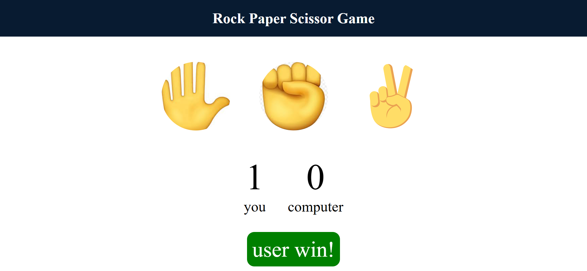

### Rock Paper Scissors Game

This is a simple and classic Rock, Paper, Scissors game built as a front-end web development project. The game allows a user to play against the computer, tracking scores and displaying the winner of each round.

#### **Features**

* **Interactive Gameplay:** Users can click on a choice (rock, paper, or scissors) to play a round against the computer.
* **Randomized Computer Choice:** The computer's choice is determined randomly using JavaScript's `Math.random()` function.
* **Score Tracking:** The game keeps a running score for both the user and the computer.
* **Dynamic UI Updates:** The user interface provides real-time feedback, showing the winner of each round and updating the scores.
* **Styling:** Clean and responsive design with distinct styles for winning, losing, and draw outcomes.

#### **Technologies Used**

* **HTML5:** The core markup language for structuring the game's elements.
* **CSS3:** Used for styling the game board, choices, score display, and message board.
* **JavaScript:** The logic for the game, including event handling, randomizing the computer's choice, determining the winner, and updating the DOM.

#### **How to Play**

1. Open the `index.html` file in your web browser.
2. Click on one of the three emoji choices: Rock (fist), Paper (hand), or Scissors (peace sign).
3. The game will automatically play a round, and the winner will be displayed below the scores.
4. The scores will update with each win.

#### **Getting Started**

To get a local copy of this project up and running, follow these simple steps:

##### 1. Clone the repository:

https://github.com/MuhammadArshadKhokhar/Rock-Paper-Scissors-Game.git

##### 2. Navigate to the project directory:

cd Rock-Paper-Scissors-Game

##### **3. Open the file:**

Open the `index.html` file in your favorite web browser to start playing the game.

#### Screenshots

##### Gameplay Screenshot:

